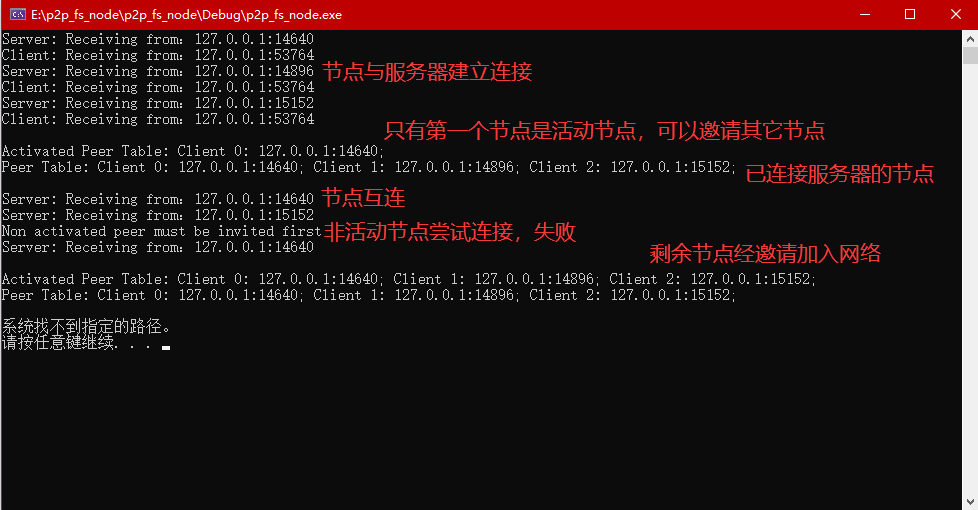

# p2p_fs_node

Linux final project - A p2p file system (only peer node part)


## 设计

本地的p2p节点，主要分为：

* 客户端client类
* 网络节点peer类


client类主要有以下功能：

* 负责与中间服务器进行交互：
  * 连接服务器，监听服务器的请求。
* 维护本地节点表，保持活性：
  * 维护一个随时可以连接的节点表，并异步的周期性发送保活请求。
* 推荐机制：
  * 除了第一个节点外的其他节点，需要由活动节点进行推荐加入网络。
  * 节点分为活动节点和一般节点，活动节点可以向一般节点发送连接请求，一般节点向活动节点的连接请求会被中间服务器拒绝。
* 加入网络：
  * 对于第一个节点，只需要直接向中间服务器发送请求进行注册
  * 对于后续节点，先向中间服务器发送请求进行注册，但是后续不能向活动节点发送连接请求。
  * UDP打洞：活动节点发送连接请求时，会先向中间服务器发送该节点要和某一般节点进行连接的请求，要求某一般节点向该节点的公网地址发送UDP信息。同时这个活动节点也会向该一般节点的公网地址发送UDP信息。至此，双方互相同时向对方打开了会话，可以无需再经过服务器进行通讯。
* 获取并维护本地节点的性能及可信度信息

* 退出网络：
  * 通知中间服务器将自己从活动节点表中删除
  * 通知自己的节点表中的节点，将自己删除
  * 处理已存数据


peer类主要存储节点相关信息，统一不同节点的属性接口：

* 唯一id
* 用于连接的外网ip和端口
* 性能和可信度信息


## 实现

### Client

* Client创建时，会同时创建一个Peer成员，用于之后存储该节点的相关信息

* Client创建后，需要通过Connect2Server函数与Server连接；

  * 具体来说，中间服务器的ip和端口是已知且固定的；Client创建一个cSocket套接字，向Server发送UDP消息。
  * 当Server的节点表为空时，Client会自动加入网络，即Server会直接将这个Client的Peer成员加入节点表。同时当Peer的id为-1时，Server会赋予这个Peer一个id，并返回一个UDP消息告知该Client，Client将自己的id更新为这个id。
  * 再向Server发送请求连接的消息后，Client会创建一个异步进程来进行后面的消息监听

* Client和其他peer进行连接（邀请机制）：

  * ```c++
    int Client::Connect2Peer(int peerId);
    ```

  * Client向Server发送一个请求，其中包含trgId属性，指示了想要连接（邀请）的节点id。Server检查源id是否已在活动表中，如果不在，则拒绝这个请求；否则，Server向目标id对应的地址发送一个带有源id地址信息的请求，令目标节点向源节点发送连接请求；同时源节点也向目标节点发送请求。至此直接连接的通道被打开。

* 退出网络
  * 节点通知Server和自己节点表中的所有节点将自己删除。


### Peer

* peer的作用类似于一个存储信息的结构。

* 为了方便请求信息的转换，实现了两个函数：

  ```c++
  json Peer::toJson();
  Peer* Peer::json2Peer(json j);
  ```

  分别将一个peer对象转换成可序列化的json，以及根据json创建一个peer对象。


## 效果

